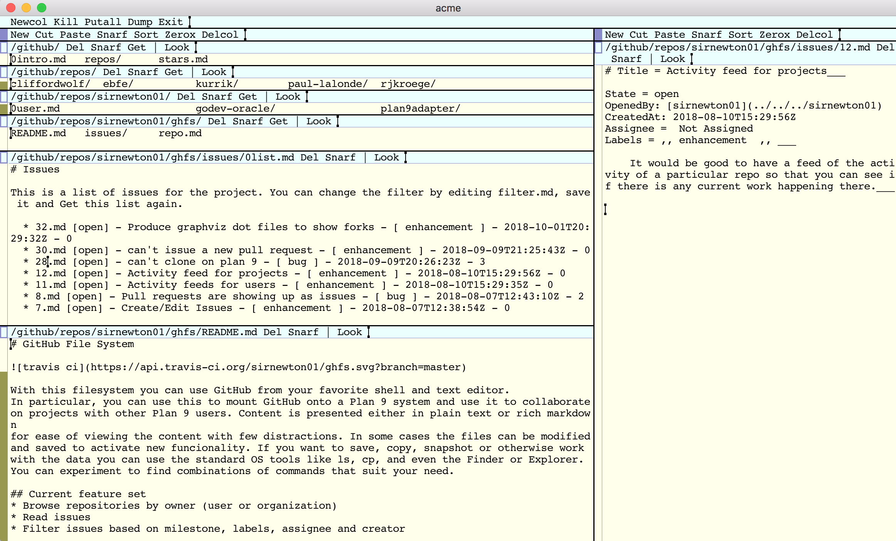

# GitHub File System


With this filesystem you can use GitHub from your favorite shell and text editor.
In particular, you can use this to mount GitHub onto a Plan 9 system and use it to collaborate
on projects with other Plan 9 users. Content is presented either in plain text or rich markdown
for ease of viewing the content with few distractions. In some cases the files can be modified
and saved to activate new funcionality. If you want to save, copy, snapshot or otherwise work
with the data you can use the standard OS tools like ls, cp, and even the Finder or Explorer.
You can experiment to find combinations of commands that suit your need.

## Current feature set
* Browse repositories by owner (user or organization)
* Read issues
* Filter issues based on milestone, labels, assignee and creator
* Vew user, organization and project metadata
* Edit project metadata
* Star/unstar projects
* Follow/unfollow users
* Create/edit issues (EXPERIMENTAL)

## Examples

```
$ ls /github/repos/sirnewton01

9p-mdns				godev				plan9adapter
Rest.ServiceProxy		godev-oracle			projectcreator
dgit				gojazz				rpi-9front
eclipse-filesystem-example	mdns				rtcdocker
gdblib				ninep				society-tests
ghfs				orion.client			ttf2plan9
git				orion.server			xinu
go				p9-tutorial
godbg				plan9-font-hack

$ cat /github/repos/sirnewton01/ghfs/repo.md

# sirnewton01/ghfs 

Description = 9p GitHub filesystem written in Go for use with Plan 9/p9p___

Starred = [x]

Notifications = () not watching (x) watching () ignoring

Created: 2018-08-05T22:21:28Z
Watchers: 10
Stars: 10
Forks: 1
Default branch: master
Pushed: 2018-10-01T20:46:19Z
Commit: 079a0fa100e6b1704bed9373f1032fd3dbad4566 2018-10-01T20:46:13Z

git clone https://github.com/sirnewton01/ghfs.git

$ cat /github/repos/sirnewton01/ghfs/issues/13.md

# Title = Show last modified time and creation time on issues___

* State = () open (x) closed
* OpenedBy: [sirnewton01](../../../sirnewton01)
* CreatedAt: 2018-08-10T15:32:24Z
* Assignee = ___
* Labels = ,, enhancement ,, ___

Body = 
'''
This becomes really useful when you are looking at issues and want to view/sort them according to how old they are or if there is recent activity.

You can do a simple ```ls -l``` to browse them yourself or even sort them using ```ls -lt``` or ```ls -Ult```
'''
___


## Comment

* User: [sirnewton01](../../../sirnewton01) 
* CreatedAt: 2018-08-10T16:47:23Z

Body = 
'''
Also, it would be useful to have the issues owned by a particular user, except that would only be visible on Plan 9, since the FUSE filesystems generally set the owners of everything to a specific user.
'''
___


## Comment

* User: [sirnewton01](../../../sirnewton01) 
* CreatedAt: 2018-09-04T02:37:59Z

Body = 
'''
The last modification time has been added.
'''
___


## Comment

* User: [sirnewton01](../../../sirnewton01) 
* CreatedAt: 2018-09-04T02:43:16Z

Body = 
'''
There's no way to expose the creation time in a filesystem.
'''
___

```

Here is how ghfs can look if you are using the Acme editor.


## End Goal
Once in a stable state it should be possible to use the GitHub filesystem to manage all of
your Plan 9 projects, create new ones, track issues and collaborate with other users. It
should be possible to use this in conjunction with a tool such as [dgit](https://github.com/driusan/dgit)
or a git filesystem to update/merge/patch/push changes to GitHub while keeping track
of the progress of the project.

## Get Started

### Plan 9 Port
Install the latest plan9port. Run ghfs. Mount the filesystem with ```9 mount localhost:5640 <mount-point>```
assuming the default tcp port 5640.

### Plan 9

Run ghfs. Post the service with `srv tcp!$yourhostname!5640 ghfs`. You can now mount the service somewhere with `mount /srv/ghfs $mountpoint`. 

## Authentication
The filesystem uses no authentication with GitHub by default. The rate limit is much lower in this mode.
You can generate a Personal Access Token in your Settings > Develper Settings screen. With a token you
can provide it in the command-line with the ```-apitoken``` flag.

If you plan to make modifications to projects (change descriptions, star/unstar projects) you will need to add
project permissions to your API token. Otherwise, changes will be silently ignored by the GitHub REST API.
Also, be sure to set the follow/unfollow users permission if you want to be able to do that within ghfs.

## Useful tricks
You can navigate to any user or organization  you want, not just the ones you follow. Open the /repos
directory, type in the name you want and right-click on it. It will open a new directory with the repos
and metadata for the name you selected. If the name doesn't exist it shows an error.

From the acme editor, you can navigate some of the hyperlinks to other users or repos by selecting
the relative link and middle-click. On Mac with Plan 9 Port you can middle click by holding down
control, alt and clicking on the text.

